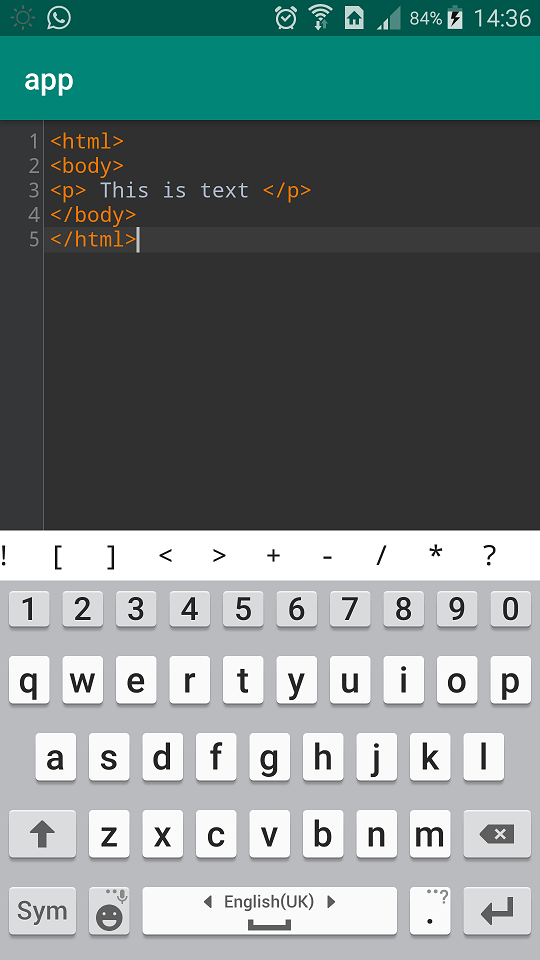

# CodeEditor   [](https://jitpack.io/#ahmadaghazadeh/CodeEditor)

This is a text/code(Base From [ModPE IDE] ) editor meant for integration as a modular component of the overall UI.
The aim is to provide a powerful editor that can be used just like any other View.

CodeEditor has been used for this purpose because it is feature-rich, fast, and easy to modify and embed in applications.


Please note that this library is currently supported on android API 15 and above.

Integration with existing project

### [Click For Play Video](https://youtu.be/lq-P1qwgU1Q)

[Stackoverflow](https://stackoverflow.com/a/52641368/1770868)

<div align="center">
  <a href="https://youtu.be/lq-P1qwgU1Q"></a>
</div>

---

### Setup

##### build.gradle (project)
```groovy
allprojects {
    repositories {
        ...
        maven {
            url 'https://jitpack.io'
        }
    }
}
```

#### build.gradle (app)
```groovy
dependencies {
    ...
    implementation 'com.github.ahmadaghazadeh:CodeEditor:1.0.17'
}
```

### Basic Usage
#### XML DataBinding
```xml
...


        <com.github.ahmadaghazadeh.editor.widget.CodeEditor
            bind:isReadOnly="@{true}"
            bind:code="@{viewModel.code}"
            bind:lang="@{viewModel.lang}"
            bind:isShowExtendedKeyboard="@{false}"
            android:layout_width="match_parent"
            android:layout_height="match_parent"/>


...
```

#### XML
```xml
...


        <com.github.ahmadaghazadeh.editor.widget.CodeEditor
            bind:code="<html></html>"
            bind:lang="html"
            bind:isReadOnly="true"
             bind:isShowExtendedKeyboard="false"
            android:layout_width="match_parent"
            android:layout_height="match_parent"/>


...
```


#### Java
Demo Activity:
```java
public class MainActivity extends Activity {

    @Override
    protected void onCreate(Bundle savedInstanceState) {
        super.onCreate(savedInstanceState);
        setContentView(R.layout.activity_main);
        editor = findViewById(R.id.editor);
         
    }
}
```
